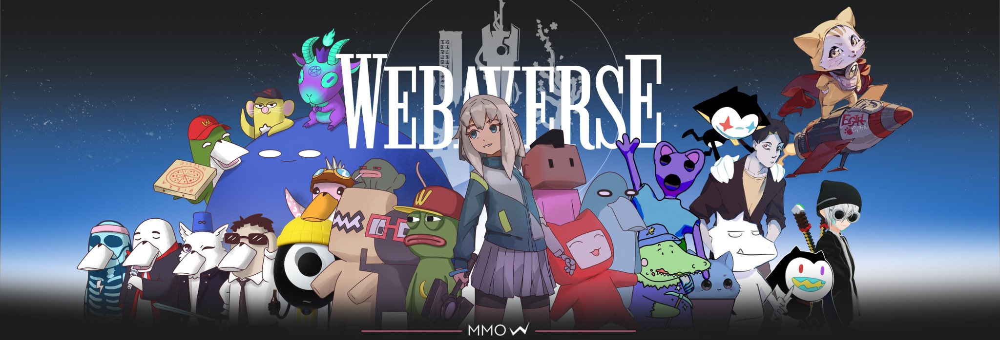

<!-- 
$$$$$$$$$$$$$$$$$$$$$$$$$$$$$$$$$$$$$$$$$$$$$^^$$()d>!i!!>ii!!!!!!i!!!iiiiiii!i!i!!!!!!!iiii>!iI[t?vdd^$$$$$$$$$$$$$$$$$$$$$$$$$$$$$$$$
$$$$$$$$$$$$$$$$$$$$$$$$$$$$$$$$$$$$$$$$$$u($$$i!l!i!llIIl!!!iiiiiiiiiiiiiiiiiiiiiiiiii!!lllIIl!!!!iiv$$^?($$$$$$$$$$$$$$$$$$$$$$$$$$$$
$$$$$$$$$$$$$$$$$$$$$$$$$$$$$$$$$$$$^d^^~l!!!lll!ll!!iiiiiiiiiiiiiiiiiiiiiiiiiiiiiiiiiiiiiiiiii!!!!!!lll!l>?^$d^$$$$$$$$$$$$$$$$$$$$$$$
$$$$$$$$$$$$$$$$$$$$$$$$$$$$$$$$$d($lIi!!lIl!iiiiiiiiiiiiiiiiiiiiiiiiiiiiiiiiiiiiiiiiiiiiiiiiiiiiiiiiii!ll!!lllid)$$$$$$$$$$$$$$$$$$$$$
$$$$$$$$$$$$$$$$$$$$$$$$$$$$$^^^$ii!ll!!!iiiiiiiiiiiiiiiiiiiiiiiiiiiiiiiiiiiiiiiiiiiiiiiiiiiiiiiiii!iiiiiii!!llll!i$v^$$$$$$$$$$$$$$$$$
$$$$$$$$$$$$$$$$$$$$$$$$$$dd1!!l!ll!iiiiiiiiiiiiiiiiiiiiiiiiiiiiiiiiiiiiiiiiiiiiiiiiiiiiiiiiiiiiiiiiiiiiiiiiiii!l!l!!!^ ^$$$$$$$$$$$$$$
$$$$$$$$$$$$$$$$$$$$$$$$vt)iill!iiiiiiiiiiiiiiiiiiiiiiiiiiiiiiiiiiiiiiiiiiiiiiiiiiiiiiiiiiiiiiiiiiiiiiiiiiiiiiiiiii!lI!i$^d$$$$$$$$$$$$
$$$$$$$$$$$$$$$$$$$$$^^vi!!ll!iiiiiiiiiiiiiiiiiiiiiiiiiiiiiiiiiiiiiiiiiiiiiiiiiiiiiiiiiiiiiiiiiiiiiiiiiiiiiiiiiiiiiii!!!l!i^^^$$$$$$$$$
$$$$$$$$$$$$$$$$$$$^]li!lliiiiiiiiiiiiiiiiiiiiiiiiiiiiiiiiiiiiiiiiiiiiiiiiiiiiiiiiiiiiiiiiiiiiiiiiiiiiiiiiiiiiiiiiiiiiii!Il!<~)$$$$$$$$
$$$$$$$$$$$$$$$$$vt>il!!!iiiiiiiiiiiiiiiiiiiiiiiiiiiiiiiiiiiiiiiiiiiiiiiiiiiiiiiiiiiiiiiiiiiiiiiiiiiiiiiiiiiiiiiiiiiiiiiii!ll!>^1$$$$$$
$$$$$$$$$$$$$$$d^l!l!iiiiiiiiiiiiiiiiiiiiiiiiiiiiiiiiiiiiiiiiiiiiiiiiiiiiiiiiii!iiiiiiiiiiiiiiiiiiiiiiiiiiiiiiiiiiiiiiiiiiiii!!i<~^$$$$
$$$$$$$$$$$$$$tdiIliiiiiiiiiiiiiiiiiiiiiiiiiiiiiiiiiiiii!!lllllllIIIlIIIll!!!!iiiiiiiiiiiiiiiiiiiiiiiiiiiiiiiiiiiiiiiiiiiiiiii!ll!i#d$$
$$$$$$$$$$$^v<ill!iiiiiiiiiiiiiiiiiiiiiiiiiiii!!l!!!llllii!!!!iiiii>!iiiiii!!lIl!!!!l!iiiiiiiiiiiiiiiiiiiiiiiiiiiiiiiiiiiiiiiiii!l!iv^$
$$$$$$$$$$v<i!l!iiiiiiiiiiiiiiiiiiiiiiiiii!ll!!!!!>`$$$$$$$^t??????jj?`?v$$$$$$$$ll!!!lIl!i!iiiiiiiiiiiiiiiiiiiiiiiiiiiiiiiiiiiii!!l>d)
$$$$$$$$v^i!!!iiiiiiiiiiiiiiiiiiiiiii!ll!lii!l~(1 $$^^^$$$$$$$$$$$$$$$$$$$$$d^^^$$v^)(>!l!l!liiiiiiiiiiiiiiiiiiiiiiiiiiiiiiiiiiiii!lli^
$$$$$$$vv>!!!iiiiiiiiiiiiiii!iiiii!!l!!!`d$vt^$$$$$$$$$$$$$$$$$$$$$$$$$$$$$$$$$$$$$$$dvt^$^<i!l!!iiiiiiiiiiiiiiiiiiiiiiiiiiiiiiiiii!!>!
$$$$$$^$il!iiiiiiiiiiiiiiiii!ii!!l!>l?tv$$$$$$$$$$$$$$$$$$$$$$$$$$$$$$$$$$$$$$$$$$$$$$$$$$$d]`!llliiiiiiiiiiiiiiiiiiiiiiiiiiiiiiiiii!li
$$$$dt_>l!iiiiiiiiiiiiiiiiiii!llliv$v$$$$$$$$$$$$$$$$$$$$$$$$$$$$$$$$$$$$$$$$$$$$$$$$$$$$$$$$dt^i!ll!iiiiiiiiiiiiiiiiiiiiiiiiiiiiiiii!i
$$$^t-il!!iiiiiiiiiiiiiiiiiili!$^($$$$$$$$$$$$$$$$$$$$$$$$$$$$$$$$$$$$$$$$$$$$$$$$$$$$$$$$$$$$$$t[>il!iiiiiiiiiiiiiiiiiiiiiiiiiiiiii!!i
$$^^li!!iiiiiiiiiiiiiiiiii!l!lvd$$$$$$$$$$$$$$$$$$$$$$$$$$$$$$$$$$$$$$$$$$$$$$$$$$$$$$$$$$$$$$$$$^~<!l!iiiiiiiiiiiiiiiiiiiiiiiiiiiiii!i
$$vli!l!iiiiiiiiiiiiiii!lliv`$$$$$$$$$$$$$$$d^^^^^^^^d$$$$$$$$$$$$$$$$$$$$$$$$$$$$$$$$$$$$$$$$$$$^1d!l!iiiiiiiiiiiiiiiiiiiiiiiiiiiii!l>
$)^i!liiiiiiiiiiiiiiiillil^$$$$$$$$$$$$$$1?$$$$$$$$$$$^)1$$$$$$$$$$$$$$$$$$$$$$$$$$$$$$$$$$$$$$$$$d$!i!!!iiiiiiiiiiiiiiiiiiiiiiiiiillil
t$!l!!iiiiiiiiiiii!!!l!ivv$$$$$$$$$$$^^d>il!llllllllll!!!~d^$$$$$$$$$$$$$$$$$$$$$$$$$$$$$$$$$$$$$$$vdilI!!!ii!!!l!llllllllllll!ll!lli-#
?tilliiiiiiiiiiiii!l!<ivd$$$$$$$$$$$'~>!llIliii!iii!ii!ll!i<>t$$$$$$$$$$$$$$$$$$$$$$$$$$$$$$$$$$$$$$$$$$[i>i>iiiii!ii>iii>i>ii!!!l!$$^$
$>!!iiiiiiiiiiiii!!!i^^$$$$$$$$$$^^^ill!!iiiiii!!!iiiiiii!!l!>^($$$$$$$$$$$$$$$$$$$$$$$$$$$$$$$$$$$$$$d$$$$^^vt((1111111111111111td$$$$
$il!iiiiiiiiiiiil!it(d$$$$$$$$$$v+i!l!iiiiiiiiiiiiiiiiiiiiii!l!`td$$$$$$$$$$$$$$$$$$$$$$$$$$$$$$$$$$$$$$$$$$$$$$$$$$$$$$$$$$$$$$$$$$$$$
?i!!iiiiiiiiii!l!>?($$$$$$$$$$^v?i!liiiiiiiiiiiiiiiiiiiiiiiii!Ii~t^$$$$$$$$$$$$$$$$$$$$$$$$$$$$$$$$$$$$$$$$$$$$$$$$$$$$$$$$$$$$$$$$$$$$
_i!!iiiiiiii!lli<v^$$$$$$$$$$$^+i!liiiiiiiiiiiiiiiiiiiiiiiiiii!l!>v^$$$$$$$$$$$$$$$$$$$$$$$$$$$$$$$$$$$$$$$$$$$$$$$$$$$$$$$$$$$$$$$$$$$
$il!iiiiii!lIi<(^$$$$$$$$$$$$[dill!iiiiiiiiiiiiiiiiiiiiiiiiiiiili>t$$$$$$$$$$$$$$$$$$$$$$$$$$$$$$$$$$$vv$$$$$$$ddddddddddddddddddd()v$$
$il!iii!lll!!^^$$$$$$$$$$$$$d$+i!!iiiiiiiiiiiiiiiiiiiiiiiiiiiiiili>^v$$$$$$$$$$$$$$$$$$$$$$$$$$$$$$$^$>!!iiiiiiiiiii!!!!!ii!ii!iii!!>^^
^$>!ll!!!i]^t$$$$$$$$$$$$$$$($>!!iiiiiiiiiiiiiiiiiiiiiiiiiiiiiiil!>v)$$$$$$$$$$$$$$$$$$$$$$$$$$$$$d(?>ll!!!lll!!llllllllllllll!!llllli~
$$^)>l`$)v$$$$$$$$$$$$$$$$$$1$!lliiiiiiiiiiiiiiiiiiiiiiiiiiiiiiiI!iv)$$$$$$$$$$$$$$$$$$$$$$$$$$$$d1$il!iiiiiiiiiiiiiiiiiiiiiiiiiiiii!!i
$$$$^^d$$$$$$$$$$$$$$$$$$$$$($>!!iiiiiiiiiiiiiiiiiiiiiiiiiiiiiiiI!>v)$$$$$$$$$$$$$$$$$$$$$$$$$$$dt~>l!iiiiiiiiiiiiiiiiiiiiiiiiiiiiiiiii
$$$^^?]]]v$$$$$$$$$$$$$$$$$$$$+>i!iiiiiiiiiiiiiiiiiiiiiiiiiiiiiili<^($$$$$$$$$$$$$$$$$$$$$$$$$$dd~>i!!iiiiiiiiiiiiiiiiiiiiiiiiiiiii!!it
$$d>!l!!li]dd$$$$$$$$$$$$$$$$)^illi!iiiiiiiiiiiiiiiiiiiiiiiiiiili>?$$$$$$$$$$$$$$$$$$$$$$$$$$$^v<!!!!iiiiiiiiiiiiiiiiiiiiiiiiiiiiiilli$
villllllll!i~td$$$$$$$$$$$$$$ddIi!!iiiiiiiiiiiiiiiiiiiiiiiiiii!li!vv$$$$$$$$$$$$$$$$$$$$$$$$$t^i!l!iiiiiiiiiiiiiiiiiiiiiiiiiiiiiiii!!>$
>l!iiiiiiilli$?$$$$$$$$$$$$$$$d^_i!liiiiiiiiiiiiiiiiiiiiiiiii!I>![^$$$$$$$$$$$$$$$$$$$$$$$$d)$illiiiiiiiiiiiiiiiiiiiiiiiiiiiiiiiiilli^~
i!iiiiiiiii!li>?^$$$$$$$$$$$$$$^^<!!l!iiiiiiiiiiiiiiiiiiiii!lli?t$$$$$$$$$$$$$$$$$$$$$$$$^d<ill!iiiiiiiiiiiiiiiiiiiiiiiiiiiiiiiii!!!l^^
iiiiiiiiiiii!l!!-vd$$$$$$$$$$$$$$^1^ill!iiiiiiiiiiiiiiiiiilllid'$$$$$$$$$$$$$$$$$$$$$$$'?+ilI!iiiiiiiiiiiiiiiiiiiiiiiiiiiiiiiiiiil!i^($
iiiiiiiiiiiii!!llidd^$$$$$$$$$$$$$$^(>!!l!ll!iiiiiiii!ll!ll!+(d$$$$$$$$$$$$$$$$$$$$$'$di!ll!iiiiiiiiiiiiiiiiiiiiiiiiiiiiiiiiiiiil!>vt$$
il!iiiiiiiiiiiiill!iI1^$$$$$$$$$$$$$$^^dIi!!!lIIIIll!!!l<?$dd$$$$$$$$$$$$$$$$$$$d^^~!!ll!iiiiiiiiiiiiiiiiiiiiiiiiiiiiiiiiiiiii!Iiiv^$$$
i!!iiiiiiiiiiiiiii!l!i<$v^d$$$$$$$$$$$$$$v^$?!~!!!i;!'^?v$$$$$$$$$$$$$$$$$$$d'$$$i!lI!iiiiiiiiiiiiiiiiiiiiiiiiiiiiiiiiiiiiii!lIil?^$$$$
$il!iiiiiiiiiiiiiiiii!l!l!iv$^^d$$$$$$$$$$$$d^vvvvvv^$$$$$$$$$$$$$$$$$^vdd^)!l!lll!!iiiiiiiiiiiiiiiiiiiiiiiiiiiiiiiiiiiiiiii!!i#td$$$$$
t$i!!iiiiiiiiiiiiiii!ii!ll!!!l>`t[(d$$$$$$$$$$$$$$$$$$$$$$$$$$$$$v(?'^>i!!!!lll!iiiiiiiiiiiiiiiiiiiiiiiiiiiiiiiiiiiiiiiiii!!!<^^$$$$$$$
^vl!!!iiiiiiiiiiiiiiii!iii!!!ll!i!li?^^^$$$$^t'1111))^tv$$$$d^^^$i!!!iill!!!iiiiiiiiiiiiiiiiiiiiiiiiiiiiiiiiiiiiiiiiiiiiill!!^^$$$$$$$$
$v^i!!!iiiiiiiiiiiiiiiiiiiiiiii!lll!!!!!!iiiii!iiii!i>ii!!iilll!!!!ll!iiiiiiiiiiiiiiiiiiiiiiiiiiiiiiiiiiiiiiiiiiiiiiiii!I!>tt$$$$$$$$$$
$$d^-i!l!iiiiiiiiiiiiiiiiiiiiiiiiiiiiiiii!lllllIIIIIIIllll!iii!iiiiiiiiiiiiiiiiiiiiiiiiiiiiiiiiiiiiiiiiiiiiiiiiiiiiiill!>]v$$$$$$$$$$$$
$$$$vI!!l!iiiiiiiiiiiiiiiiiiiiiiiiiiiiiiiiiiiiiiiiiiiiiiiiiiiiiiiiiiiiiiiiiiiiiiiiiiiiiiiiiiiiiiiiiiiiiiiiiiiiiiii!!!l!vv$$$$$$$$$$$$$$
$$$$$d)1i!!iiiiiiiiiiiiiiiiiiiiiiiiiiiiiiiiiiiiiiiiiiiiiiiiiiiiiiiiiiiiiiiiiiiiiiiiiiiiiiiiiiiiiiiiiiiiiiiiiiiii!Ili~v^$$$$$$$$$$$$$$$$
$$$$$$d1!!!!iiiiiiiiiiiiiiiiiiiiiiiiiiiiiiiiiiiiiiiiiiiiiiiiiiiiiiiiiiiiiiiiiiiiiiiiiiiiiiiiiiiiiiiiiiiiiiiiii!!!!<~v$$$$$$$$$$$$$$$$$$
$$$$$$$$^v>!l!iiiiiiiiiiiiiiiiiiiiiiiiiiiiiiiiiiiiiiiiiiiiiiiiiiiiiiiiiiiiiiiiiiiiiiiiiiiiiiiiiiiiiiiiiiiiiill!i^d^$$$$$$$$$$$$$$$$$$$$
$$$$$$$$$^^!!l!iiiiiiiiiiiiiiiiiiiiiiiiiiiiiiiiiiiiiiiiiiiiiiiiiiiiiiiiiiiiiiiiiiiiiiiiiiiiiiiiiiiiiiiii!Ill!I'($$$$$$$$$$$$$$$$$$$$$$$
$$$$$$$$$$$v~!!l!iiiiiiiiiiiiiiiiiiiiiiiiiiiiiiiiiiiiiiiiiiiiiiiiiiiiiiiiiiiiiiiiiiiiiiiiiiiiiiiiiii!!ll!!>^^d$$$$$$$$$$$$$$$$$$$$$$$$$
$$$$$$$$$$$$^?$ill!iiiiiiiiiiiiiiiiiiiiiiiiiiiiiiiiiiiiiiiiiiiiiiiiiiiiiiiiiiiiiiiiiiiiiiiiiiiiiiilI!!i$^($$$$$$$$$$$$$$$$$$$$$$$$$$$$$
$$$$$$$$$$$$$$^v>!lliiiiiiiiiiiiiiiiiiiiiiiiiiiiiiiiiiiiiiiiiiiiiiiiiiiiiiiiiiiiiiiiiiiiiiiii!ll!l!!_'^$$$$$$$$$$$$$$$$$$$$$$$$$$$$$$$$
$$$$$$$$$$$$$$$^d~i!l!iiiiiiiiiiiiiiiiiiiiiiiiiiiiiiiiiiiiiiiiiiiiiiiiiiiiiiiiiiiiiiiii!!!lli!!ild$)d$$$$$$$$$$$$$$$$$$$$$$$$$$$$$$$$$$
$$$$$$$$$$$$$$$$$dvI!!l!ii!!iiiiiiiiiiiiiiiiiiiiiiiiiiiiiiiiiiiiiiiiiiiiiiiiiiiiiiiill!!ii!:>^)td$$$$$$$$$$$$$$$$$$$$$$$$$$$$$$$$$$$$$$
$$$$$$$$$$$$$$$$$$$d^_!ll!iiiiiiiiiiiiiiiiiiiiiiiiiiiiiiiiiiiiiiiiiiiiiiiiiiiiiii!!!i!>(^ddvd$$$$$$$$$$$$$$$$$$$$$$$$$$$$$$$$$$$$$$$$$$
$$$$$$$$$$$$$$$$$$$$$t$?!lliiiiiiiiiiiiiiiiiiiiiiiiiiiiiiiiiiiiiiiiiiiiiiiiiiii!!!>$$?$$$$$$$$$$$$$$$$$$$$$$$$$$$$$$$$$$$$$$$$$$$$$$$$$
$$$$$$$$$$$$$$$$$$$$$$$^v<!!l!iiiiiiiiiiiiiiiiiiiiiiiiiiiiiiiiiiiiiiiiiiiiiiiil!ii1^$$$$$$$$$$$$$$$$$$$$$$$$$$$$$$$$$$$$$$$$$$$$$$$$$$$
$$$$$$$$$$$$$$$$$$$$$$$$$dd>il!!iiiiiiiiiiiiiiiiiiiiiiiiiiiiiiiiiiiiiiiiiiii!il!<tt$$$$$$$$$$$$$$$$$$$$$$$$$$$$$$$$$$$$$$$$$$$$$$$$$$$$
$$$$$$$$$$$$$$$$$$$$$$$$$$$dt>!ll!!!iiiiiiiiiiiiiiiiiiiiiiiiiiiiiiiiiiiiiiiiiiii_d^$$$$$$$$$$$$$$$$$$$$$$$$$$$$$$$$$$$$$$$$$$$$$$$$$$$$
$$$$$$$$$$$$$$$$$$$$$$$$$$$$$vvi!lliiiiiiiiiiiiiiiiiiiiiiiiiiiiiiiiiiiiiiiiii!iiI$d$$$$$$$$$$$$$$$$$$$$$$$$$$$$$$$$$$$$$$$$$$$$$$$$$$$$
$$$$$$$$$$$$$$$$$$$$$$$$$$$$$$dtt>!Iiiiiiiiiiiiiiiiiiiiiiiiiiiiiiiiiiiiiiiii!!ii;d^$$$$$$$$$$$$$$$$$$$$$$$$$$$$$$$$$$$$$$$$$$$$$$$$$$$$
$$$$$$$$$$$$$$$$$$$$$$$$$$$$$$$$$vii!!!iiiiiiiiiiiiiiiiiiiiiiiiiiiiiiiiiiiiiii!i<^v$$$$$$$$$$$$$$$$$$$$$$$$$$$$$$$$$$$$$$$$$$$$$$$$$$$$
$$$$$$$$$$$$$$$$$$$$$$$$$$$$$$$$$$$?^ill!iiiiiiiiiiiiiiiiiiiiiiiiiiiiiiiiiiii!I!!^^$$$$$$$$$$$$$$$$$$$$$$$$$$$$$$$$$$$$$$$$$$$$$$$$$$$$
$$$$$$$$$$$$$$$$$$$$$$$$$$$$$$$$$$$$$?>!!lliiiiiiiiiiiiiiiiiiiiiiiiiiiiiiiiii!I!itt$$$$$$$$$$$$$$$$$$$$$$$$$$$$$$$$$$$$$$$$$$$$$$$$$$$$
$$$$$$$$$$$$$$$$$$$$$$$$$$$$$$$$$$$$$$^v]i!l!!iiiiiiiiiiiiiiiiiiiiiiiiiiiiiii!lii)$$$$$$$$$$$$$$$$$$$$$$$$$$$$$$$$$$$$$$$$$$$$$$$$$$$$$
$$$$$$$$$$$$$$$$$$$$$$$$$$$$$$$$$$$$$$$$$x$_!ll!iiiiiiiiiiiiiiiiiiiiiiiiiiiiiiiiii^t$$$$$$$$$$$$$$$$$$$$$$$$$$$$$$$$$$$$$$$$$$$$$$$$$$$
$$$$$$$$$$$$$$$$$$$$$$$$$$$$$$$$$$$$$$$$$$d$di!lliiiiiiiiiiiiiiiiiiiiiiiiiiiiiiIli^1$$$$$$$$$$$$$$$$$$$$$$$$$$$$$$$$$$$$$$$$$$$$$$$$$$$
$$$$$$$$$$$$$$$$$$$$$$$$$$$$$$$$$$$$$$$$$$$$$^vii!l!!!iiiiiiiiiiiiiiiiiiiiiiiiil!i^^$$$$$$$$$$$$$$$$$$$$$$$$$$$$$$$$$$$$$$$$$$$$$$$$$$$
$$$$$$$$$$$$$$$$$$$$$$$$$$$$$$$$$$$$$$$$$$$$$$$^]I>!lliiiiiiiiiiiiiiiiiiiiiiiii!ii+$$$$$$$$$$$$$$$$$$$$$$$$$$$$$$$$$$$$$$$$$$$$$$$$$$$$
$$$$$$$$$$$$$$$$$$$$$$$$$$$$$$$$$$$$$$$$$$$$$$$$$v^+!ll!!iiiiiiiiiiiiiiiiiiiiii!ll>d)$$$$$$$$$$$$$$$$$$$$$$$$$$$$$$$$$$$$$$$$$$$$$$$$$$
$$$$$$$$$$$$$$$$$$$$$$$$$$$$$$$$$$$$$$$$$$$$$$$$$$$$d^!ill!iiiiiiiiiiiiiiiiiiiiilli^]$$$$$$$$$$$$$$$$$$$$$$$$$$$$$$$$$$$$$$$$$$$$$$$$$$
$$$$$$$$$$$$$$$$$$$$$$$$$$$$$$$$$$$$$$$$$$$$$$$$$$$$$$v+>ill!iiiiiiiiiiiiiiiiiiillid[$$$$$$$$$$$$$$$$$$$$$$$$$$$$$$$$$$$$$$$$$$$$$$$$$$
$$$$$$$$$$$$$$$$$$$$$$$$$$$$$$$$$$$$$$$$$$$$$$$$$$$$$$$$^$d>!ll!iiiiiiiiiiiiiiii!!idd$$$$$$$$$$$$$$$$$$$$$$$$$$$$$$$$$$$$$$$$$$$$$$$$$$
$$$$$$$$$$$$$$$$$$$$$$$$$$$$$$$$$$$$$$$$$$$$$$$$$$$$$$$$$$$^]->!!l!iiiiiiiiiiiii!!i~$d$$$$$$$$$$$$$$$$$$$$$$$$$$$$$$$$$$$$$$$$$$$$$$$$$
$$$$$$$$$$$$$$$$$$$$$$$$$$$$$$$$$$$$$$$$$$$$$$$$$$$$$$$$$$$$$d$`>illll!iiiiiiiii!!iv$$$$$$$$$$$$$$$$$$$$$$$$$$$$$$$$$$$$$$$$$$$$$$$$$$$
$$$$$$$$$$$$$$$$$$$$$$$$$$$$$$$$$$$$$$$$$$$$$$$$$$$$$$$$$$$$$$$$(d$<i!!Il!iiiiiilli^[$$$$$$$$$$$$$$$$$$$$$$$$$$$$$$$$$$$$$$$$$$$$$$$$$$
$$$$$$$$$$$$$$$$$$$$$$$$$$$$$$$$$$$$$$$$$$$$$$$$$$$$$$$$$$$$$$$$$$dd^^!!!!l!!!!!!ii^$$$$$$$$$$$$$$$$$$$$$$$$$$$$$$$$$$$$$$$$$$$$$$$$$$$ -->



<p align="center">
    <a href="https://github.com/webaverse/app/graphs/contributors" alt="Contributors">
        </a>
    <a href="https://discord.gg/webaverse">
        </a>
    <a href="https://twitter.com/intent/follow?screen_name=webaverse">
        </a>
</p>
<h1 align="center">Webaverse</h1>
<p align="center">
An open source web3 metaverse game engine that anyone can host. Easy to use, runs in the browser and utilizes open tools and standards like <a href="https://github.com/mrdoob/three.js">three.js</a> and <a href="https://github.com/nodejs/node">Node</a>.
</p>
<p align="center">
Everything you need to get started with building in the Webaverse is contained in this repository.
</p>

## Key Features

- 🎮 A full-featured game engine running in your browser
- ♾️ Infinite procedurally generated world
- 🧑‍🤝‍🧑 Multiplayer with voice and chat
- 🤖 AI-powered non-player characters
- 👓 Supports desktop and VR (mobile coming soon)
- 😊 Expressive, vocal and emotive avatars
- 🔮 Runtime support for user uploads and custom apps
- 🖥️ Completely self-hostable

<p align="center">


</p>
<p align="center">

</p>
<p align="center">


</p>

<h1 align="center">Documentation</h1>
<p align="center">
Developer documentation is <a href="https://docs.webaverse.com/docs/index">here</a><br />
User documentation is <a href="https://webaverse.notion.site/User-Docs-3a36b223e39b4f94b3d1f6921a4c297a">here</a>
</p>

## Minimum Requirements
- Node.js 16 or greater ([nvm](https://github.com/nvm-sh/nvm) is recommended)
- 10 GB Disk Space
- 8 GB RAM
- 4 Core CPU / vCPUs

## Installation

**Important note before you clone this repo:** This repo uses Git submodules.
You need to install with the `--recurse-submodules` flag or installation will not work. Copy the code below to clone the repository if you aren't sure.

```sh
git clone --recurse-submodules https://github.com/webaverse/app.git
cd app/ # Go into the repository
git pull --recurse-submodules # Pull recursively
npm install # Install dependencies
```

##### Note for Windows Users
We recommend that you use Windows Subsystem for Linux to run Webaverse. This [video](https://www.youtube.com/watch?v=5RTSlby-l9w) shows you how you can set up WSL. Once you've installed it, run `wsl` in your terminal to enter Ubuntu, and then run Webaverse from there.

## Quickstart

Starting the application is as easy as:

```sh
npm run start
```

Once the server has started up, you can visit `https://local.webaverse.com` 

## Let's build it together!

We would love for you to come build with us. First, please review the documentation in it's entirety before contributing. Also join our [Discord](https://discord.gg/webaverse) and introduce yourself.

##### New Issues and Features

Please search Github issues before reporting a new issue or starting a new feature. If you are starting a new feature or bug fix, please write up or reference an issue and indicate that you are working on it.

##### Pull Requests

Please make sure your PRs change as little existing code as is necessary to prevent upstream merge conflicts. When posting a pull request, please document what the PR does and how it can be reviewed and QA'd. PRs will be reviewed and accepted if they conform to our linting and code conventions, don't cause any bugs and don't decrease performance of the app.


